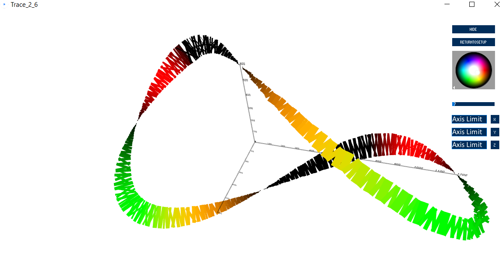

# Trace
A multi-dimensional, real time data plotter and logger.  
  

  
      

   
  
A sample plot, generated by plotting the 5 parameters generated by "SampleSerialDataCreator" on the x, y, z, thickness, and red and green 'axes.'    

---
    
**How to use Trace.**  
Connect some source of CSV serial data to your computer (ex. `Serial.println("5");` with an Arduino)  
Open and run Trace in the Processing IDE.  
Select the appropriate baud rate and COM port for your device.  
Set the Normalization Parameter: the maximum integer value that your device will send.  
Press 'connect.'  
Select a dimension, then select a measurement to map to that dimension.  
Do this for as many dimensions as are desired.  
Click "Add Trace" to create the trace made from this information.  
Add as many traces as are desired.  
Click "Done" when finished to view the traces.  
Pan, rotate, and zoom in this view, and adjust the background color using the 2D slider on the side of the window.  

---
  
**Version 2_6:** Added camera. Camera can pan, zoom, and rotate. Data can be logged to csv.
Added HUD to trace display window; has various options. Added axes (x, y, z lines and numbered labels)
Added the ability to delete traces (currently all at once; a scrollable dropdown could be added).
Changed name of file to Trace. Allows window resizing (however, there are camera issues). Connection can be established after startup (COM port selection, Baud rate, and normalization parameter). Added the ability to change limits of X, Y, and Z axes
(See 'changes' in the 2_6 folder for more detail.)
   
---
   
**Version 2_0:** Adds multiple dimensions, as well as user definition of traces.
The startup screen allows the user to create traces by selecting the which incoming measurements map to which dimensions.
This version offers 10 dimension options (X, Y, Z, Thickness, Opacity, Grayscale, RGB, Red, Green, Blue).

---
  
**Version 1.0:** Plots any number of measurements vs time; like a multi-channel oscilloscope. This version offers little flexibility, and is primarily intended as a demo or as a starting point for your own additions.

This version expects data to be streaming over a COM port at startup.
Data is expected as integers in a CSV format; whitespace will be cleaned.
Each index in a given line of measurements (i.e. 1, 2, 3, ...) will be plotted as a trace.
Theoretically, any number of traces can be created.
